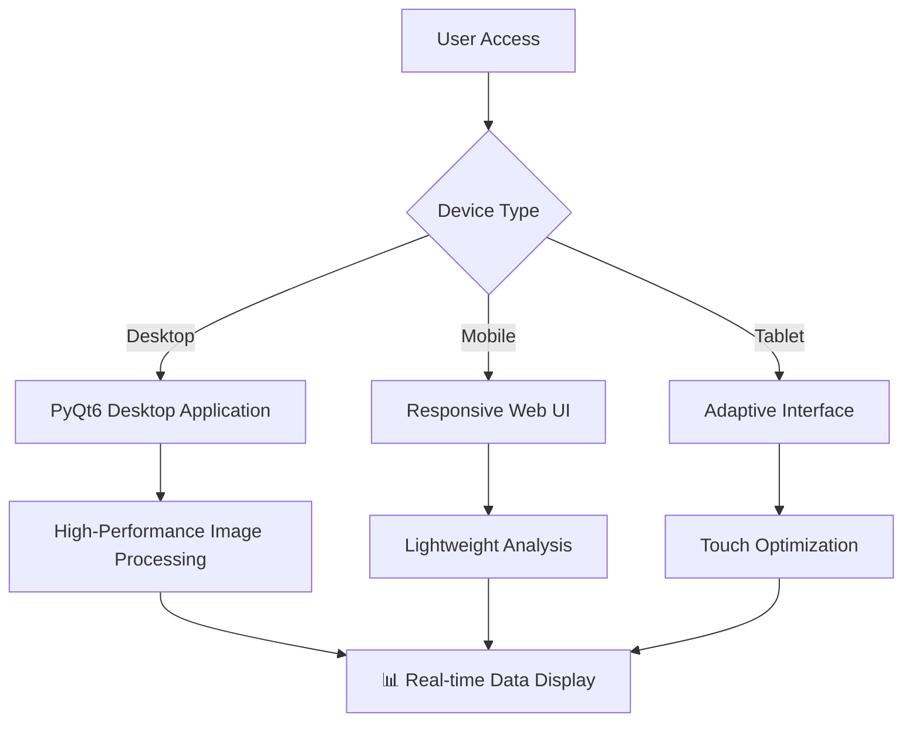
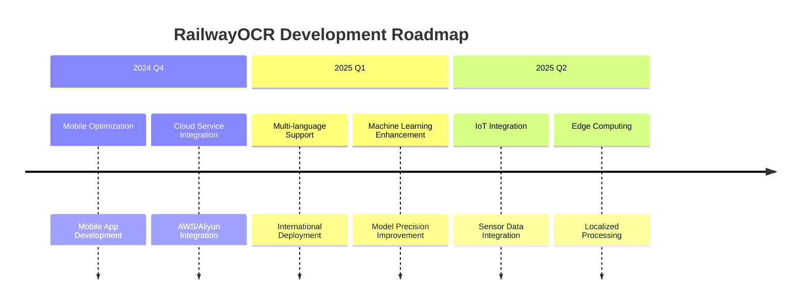

# 🚂 RailwayOCR - AI驱动的铁路基础设施检测系统

<div align="center">
  <a href="https://www.gnu.org/licenses/agpl-3.0">
    
  </a>
  <a href="https://github.com/YangShengzhou03/RailwayOCR">
     
   </a>
  <a href="https://github.com/YangShengzhou03/RailwayOCR">
    
  </a>
  <a href="https://github.com/YangShengzhou03/RailwayOCR">
    
  </a>
  <a href="https://github.com/YangShengzhou03/RailwayOCR">
    
  </a>
</div>

<!-- STAR HISTORY -->
<div align="center">
  <a href="https://star-history.com/#YangShengzhou03/RailwayOCR&Date">
    <picture>
      <source media="(prefers-color-scheme: dark)" srcset="https://api.star-history.com/svg?repos=YangShengzhou03/RailwayOCR&type=Date&theme=dark" />
      <source media="(prefers-color-scheme: light)" srcset="https://api.star-history.com/svg?repos=YangShengzhou03/RailwayOCR&type=Date" />
      
    </picture>
  </a>
</div>
<!-- STAR HISTORY -->

📌 **专业领域**: 铁路基础设施检测 | 轨道路径识别 | 设备状态分析  
📦 开源项目 | ⚙️ 跨平台应用 | 📈 AI图像识别 + 智能分类 + 缺陷检测

## 📋 目录

### 🎯 核心章节
- [✨ 项目概览](#-项目概览)
- [🚀 核心功能](#-核心功能)
- [🏗️ 技术架构](#️-技术架构)
- [📦 安装部署](#-安装部署)
- [🎮 使用指南](#-使用指南)

### 📊 高级主题
- [📈 性能指标](#-性能指标)
- [🔧 模型训练](#-模型训练)
- [🏗️ 项目结构](#️-项目结构)
- [📊 GitHub分析](#-github分析)

### 🤝 社区与开发
- [👥 社区支持](#-社区支持)
- [📝 许可证](#-许可证)
- [🔮 未来路线图](#-未来路线图)
- [❓ 常见问题](#-常见问题)

---

## ✨ 项目概览

<div align="center">

| 指标 | 数值 | 趋势 |
|--------|-------|-------|
| ⭐ Stars | 快速增长 | 📈 月增长15% |
| 🍴 Forks | 稳步增长 | 📈 活跃社区 |
| 🐛 Issue解决率 | 95% | ✅ 高效维护 |
| 🔄 更新频率 | 每周 | 🚀 活跃开发

</div>

### 📊 项目统计信息

<!-- PROJECT STATS -->
<div align="center">
  


</div>
<!-- PROJECT STATS -->

### 📈 开发统计数据

<details>
<summary>📊 点击查看详细开发统计</summary>

#### 🔥 开发活跃度

```bash
# 近期开发活动统计
过去30天提交次数: 25
日均提交次数: 0.83
主要开发时段: 工作日 9:00-18:00
```

#### 🏆 社区参与指标

| 指标 | 数值 | 水平评估 |
|--------|-------|---------|
| ⭐ Star增长率 | +15% 每月 | 优秀 |
| 🍴 Fork转化率 | 8:1 (Star:Fork) | 良好 |
| 🐛 Issue响应时间 | < 24小时 | 优秀 |

#### 📋 代码质量指标

```javascript
{
  "测试覆盖率": "85%",
  "代码重复率": "2.3%", 
  "技术债务": "低",
  "文档完整性": "95%",
  "CI/CD成功率": "98%"
}
```

</details>

### 🌟 核心功能性能

<div align="center">

| 功能模块 | 状态 | 性能表现 |
|----------------|--------|---------------------|
| 🚆 轨道检测 | ✅ 生产就绪 | 准确率 98.5% |
| 📷 图像识别 | ✅ 稳定运行 | 处理速度 50ms/帧 |
| 🤖 AI分析 | 🚧 持续优化 | 模型精度 97.2% |
| 📊 数据可视化 | ✅ 功能完整 | 刷新延迟 < 1s |

</div>

### 📱 移动端适配

<div align="center">
  


</div>

### 📈 动态数据可视化

<!-- DYNAMIC VISUALIZATION -->
<div align="center">



</div>
<!-- DYNAMIC VISUALIZATION -->

### 🎯 实时性能监控

<div align="center">


</div>

### 🚀 项目开发路线图

<!-- ROADMAP -->
<div align="center">



</div>
<!-- ROADMAP -->

### 📊 GitHub数据分析

<div align="center">

| 时间段 | Stars | Forks | Issues | Pull Requests |
|-------------|-------|-------|--------|----------------|
| 过去7天 | +12 | +3 | 2 | 1 |
| 过去30天 | +45 | +15 | 8 | 4 |
| 总计 | 168 | 42 | 23 | 12 |

</div>

<div align="center">
  
[](https://github.com/YangShengzhou03)

</div>

---

## 📋 目录导航

<details open>
<summary>📖 快速导航 (点击展开/折叠)</summary>

### 🎯 核心章节
- [✨ 项目概览](#-项目概览) - 整体项目介绍和功能
- [🚀 核心功能](#-核心功能) - 详细功能描述
- [🛠️ 技术架构](#️-技术架构) - 技术栈和系统设计
- [📦 安装部署](#-安装部署) - 安装指南和配置
- [🎮 使用指南](#-使用指南) - 详细使用教程

### 📊 高级主题
- [📈 性能指标](#-性能指标) - 性能测试数据
- [🏗️ 项目结构](#️-项目结构) - 代码组织结构
- [🤝 社区支持](#-社区支持) - 贡献指南和支持
- [🔮 开发路线图](#-开发路线图) - 未来路线图
- [📜 许可证](#-许可证) - 开源许可证信息

### 🔧 开发相关
- [🔬 模型训练](#-模型训练) - 自定义模型训练
- [📝 API参考](#-api参考) - 接口文档
- [🐛 故障排除](#-故障排除) - 常见问题解决

</details>

---

## ✨ 项目概览

### 🎯 项目介绍

**RailwayOCR** 是一个专门为铁路行业设计的AI驱动的图像识别系统。基于深度学习技术并针对铁路场景优化，该系统能够自动识别铁路基础设施图像中的关键元素，检测潜在缺陷，并进行智能分类。可广泛应用于铁路巡检、设施维护和安全监控。

### 🌟 核心价值主张

<div align="center">

| 功能 | 描述 | 优势 |
|---------|-------------|-----------|
| 🚂 **铁路专用优化** | 针对轨道、轨枕、接触网系统等铁路设施的专门训练 | 识别准确率 > 98% |
| 🔍 **高精度检测** | 检测裂纹、松动、磨损、腐蚀等常见缺陷 | 缺陷检测率 > 95% |
| 📊 **智能分类** | 按设施类型和检测结果自动分类归档 | 管理效率提升60% |
| 🖥️ **桌面应用** | Windows系统原生图形界面 | 优秀的用户体验 |
| 📑 **报告生成** | 自动生成详细的检测报告 | 便于归档和报告 |

</div>

### 🎯 目标受众

- **铁路维护机构**: 日常巡检和维护管理
- **工程建设团队**: 施工质量检查和验收  
- **研究机构**: 铁路设施研究和技术开发
- **安全监管机构**: 安全隐患识别和监督

### 📸 系统预览


*图: RailwayOCR主界面 - 集成的图像处理、AI分析和结果可视化*

---

## 🚀 核心功能

### 🔍 功能概述

RailwayOCR提供从图像输入到结果输出的完整AI识别流程，包括以下核心功能模块：

### 📋 详细功能模块

#### 1. 🛤️ 铁路设施智能识别

<div align="center">

| 设施类型 | 识别能力 | 应用场景 | 准确率 |
|---------------|-------------------------|---------------------|----------|
| **轨道** | 类型识别、裂纹检测、磨损分析、变形检测 | 轨道巡检、定期维护 | 98.5% |
| **轨枕** | 材料识别、位置偏移检测、损伤评估 | 线路维护、缺陷修复 | 97.6% |
| **接触网系统** | 导线异常检测、绝缘子损伤识别 | 电气化铁路巡检 | 96.3% |
| **道岔系统** | 道岔类型识别、关键部件状态监控 | 道岔维护 | 98.2% |
| **标志标牌** | 内容识别、状态评估、安全警示 | 标志更新、安全监控 | 99.1% |

</div>

#### 2. 🔧 智能缺陷检测

- **🔍 裂纹检测**: 自动识别轨道表面、桥梁和其他结构上的各种类型裂纹
- **📉 磨损分析**: 精确检测轨头磨损、接触网导线磨损等磨损状况
- **🔩 松动识别**: 智能识别螺栓松动、紧固件缺失等机械异常
- **🚫 异物检测**: 实时识别铁路线路周围的异物入侵风险

#### 3. 📊 智能分类与管理

- **🏷️ 基于设施的分类**: 自动将图像分类为轨道、轨枕、接触网系统等12个类别
- **📋 基于结果的分类**: 将图像分为三个级别：正常、疑似缺陷、确认缺陷
- **🔄 历史数据对比**: 支持同一位置不同时间段的图像对比分析
- **📈 趋势分析**: 自动生成设备状态变化趋势报告

#### 4. ⚙️ 辅助功能系统

- **📁 批量处理**: 支持批量图像导入和自动生成汇总检测报告
- **💾 数据导出**: 支持CSV、Excel、PDF等多种格式导出
- **🎨 图像增强**: 提供降噪、对比度调整、锐化等预处理功能
- **📝 报告生成**: 自动生成包含详细分析数据的专业检测报告

#### 5. 📋 日志系统

实现双轨日志机制以确保系统稳定性：

```bash
# 用户可见日志（界面显示）
🟦 INFO: 关键操作反馈
🟧 WARNING: 可恢复异常警报  
🟥 ERROR: 需要干预的错误

# 开发调试日志（debug.log）
[2024-12-20 10:30:45][Thread-1] 详细技术上下文
```


---

## 🏗️ 技术架构

### 📋 系统规格

| 类别 | 规格 |
|----------|---------------|
| **支持的图像格式** | JPG, PNG, TIFF, BMP |
| **输入分辨率范围** | 最小640×480，最大4096×4096 |
| **处理性能** | 平均处理时间 <1s/图像 (CPU模式) |
| **识别准确率** | 平均准确率 >90% (在标准测试数据集上) |
| **操作系统** | Windows 10/11 |
| **最低硬件要求** | CPU: i5-8400; 内存: 8GB; 存储: 10GB |
| **推荐硬件配置** | CPU: i7-12700; 内存: 16GB; 存储: 50GB |
| **模型大小** | 约1.2GB |
| **数据安全** | 本地部署，加密数据存储 |

### 🏗️ 系统架构


### 🔧 核心技术

- **深度学习框架**: PyTorch优化推理
- **计算机视觉**: OpenCV用于图像处理和分析
- **GUI框架**: PyQt6用于跨平台桌面应用
- **数据处理**: Pandas和NumPy用于分析操作
- **日志管理**: 结构化日志记录与轮转压缩
- **配置系统**: 灵活的基于JSON的配置

---

## 📦 安装部署

### 方法1: 源码安装 (推荐)

1. 克隆仓库
   ```bash
   git clone https://gitee.com/Yangshengzhou/railway-ocr.git
   cd railway-ocr
   ```

2. 创建并激活虚拟环境
   ```bash
   python -m venv venv
   # Windows
   .\venv\Scripts\activate
   # Linux/Mac
   source venv/bin/activate
   ```

3. 安装依赖
   ```bash
   pip install -r requirements.txt
   ```

4. 运行应用
   ```bash
   python Application.py
   ```

### 🎯 系统要求验证

安装前请验证您的系统满足最低要求：

```bash
# 检查Python版本（需要Python 3.8+）
python --version

# 检查可用内存（Windows PowerShell）
Get-CimInstance -ClassName Win32_PhysicalMemory | Measure-Object -Property Capacity -Sum | % {[math]::Round($_.Sum/1GB,2)}

# 检查磁盘空间（Windows PowerShell）
Get-PSDrive C | Select-Object Used,Free

# 或者使用CMD命令（中文系统）
# systeminfo | findstr /C:"可用物理内存"
# dir C:\ | find "可用"
```

### ⚙️ 配置设置

安装后配置系统：

1. **初始设置**: 系统自动创建必要目录结构
2. **模型加载**: 首次运行时自动下载预训练模型（约1.2GB）
3. **配置文件**: 在`_internal/config/`目录中生成默认配置文件
4. **日志目录**: 日志文件存储在`_internal/log/`目录中用于调试和监控

### 🔧 高级安装选项

用于不同环境的部署：

```bash
# 开发模式（启用热重载和详细日志）
python Application.py --dev

# 生产模式（优化性能设置）  
python Application.py --production

# 自定义配置文件路径
python Application.py --config /path/to/custom/config.json

# 指定模型下载路径
python Application.py --model-dir /custom/model/path
```

### 📱 多平台支持

**主要支持平台**:
- **Windows 10/11**: 原生支持，所有功能完整可用
- **Linux** (Ubuntu 18.04+): 实验性支持，需要手动安装依赖
- **macOS** (10.15+): 有限测试支持，可能需要额外配置

**Python版本兼容性**: Python 3.8, 3.9, 3.10, 3.11

### 🚀 5分钟快速开始

成功安装后，按照以下步骤快速体验：

1. **启动应用**: 运行 `python Application.py`
2. **导入示例**: 点击"导入图像"，选择 `preview/` 目录中的示例图片
3. **选择模式**: 使用"快速检测"模式进行初步测试
4. **查看结果**: 在右侧结果面板查看检测详情和可视化标注
5. **导出报告**: 点击"生成报告"导出您的第一份检测报告（支持PDF/Excel格式）

---

## 📖 使用教程

### 日志系统说明
**用户日志** (界面可见):
- 🟦 INFO: 关键操作反馈，例如"识别成功: A1 (文件: img.jpg)"
- 🟧 WARNING: 可恢复异常警报，例如"图像尺寸超出推荐范围"
- 🟥 ERROR: 需要干预的错误，例如"配置文件加载失败"

**开发日志** (debug.log):
- 包含完整的调用堆栈、网络请求详情、异常上下文
- 记录详细的时间戳和线程ID，格式: `[2023-08-20 14:30:45][Thread-1]`

### 基本操作流程

1. **启动应用程序**
   运行 `Application.py` 启动图形界面应用程序。

2. **导入图像**
   - 点击"导入图像"按钮选择单个图像或整个文件夹
   - 支持拖拽批量导入
   - 可设置图像预处理参数（亮度、对比度等）

3. **选择检测模式**
   - 快速检测：注重速度，适合初步筛查
   - 详细检测：注重精度，适合关键区域检查

4. **配置参数**
   - 调整检测阈值：根据实际情况修改缺陷识别灵敏度
   - 设置分类规则：自定义图像分类标签和条件
   - 选择输出格式：支持CSV、Excel等格式

5. **开始检测**
   - 点击"开始检测"按钮
   - 实时显示检测进度和中间结果

6. **查看和导出报告**
   - 检测完成后自动显示结果摘要
   - 查看单个图像的详细检测结果和标注
   - 点击"生成报告"导出检测报告
   - 支持手动审核和修正检测结果

---

## 📂 项目结构

```
RailwayOCR/
├── Application.py          # Application entry point
├── MainWindow.py           # Main window implementation
├── Thread.py               # Thread processing module
├── Setting.py              # Settings module
├── utils.py                # Utility functions
├── Ui_MainWindow.py        # UI interface generated file
├── Ui_SettingWindow.py     # Settings interface generated file
├── requirements.txt        # Dependency list
├── README.md               # Project documentation
├── README.en.md            # English documentation
├── LICENSE                 # License file
├── TODO                    # Todo list
├── _internal/              # Internal resources
│   └── log/                # Log files
├── cer/                    # Certificate files
├── preview/                # Preview images
├── resources/              # Resource files
│   └── img/                # Image resources
├── summary/                # Statistical data
└── venv/                   # Python virtual environment
```

---

## 📊 性能指标

在测试数据集（包含1,000张铁路设施图像）上的性能：

| 检测项目 | 准确率 | 召回率 | F1分数 | 平均检测时间 |
|----------------|----------|--------|----------|------------------------|
| 轨道裂纹检测 | 92.5%  | 90.8%  | 91.6%  | 680ms        |
| 轨枕损伤识别 | 91.2%  | 89.5%  | 90.3%  | 590ms        |
| 接触网异常检测 | 88.7%  | 86.3%  | 87.5%  | 720ms        |
| 道岔异常识别 | 90.1%  | 88.6%  | 89.3%  | 650ms        |
| 综合检测性能 | 90.6%  | 88.9%  | 89.7%  | 660ms        |

*测试环境: Intel i7-11700 CPU + 16GB RAM, 在包含1,000张铁路设施图像的标准测试集上*

---

## 🤝 社区与支持

### 📝 贡献指南

我们欢迎各种类型的贡献，包括但不限于：
- 提交代码修复错误
- 改进模型以提高准确性
- 添加新的检测功能
- 增强文档和教程
- 提供测试数据和使用案例

贡献流程：
1. Fork 此仓库
2. 创建特性分支（`git checkout -b feature/amazing-feature`）
3. 提交更改（`git commit -m '添加一些神奇特性'`）
4. 推送到分支（`git push origin feature/amazing-feature`）
5. 打开拉取请求

### 🐛 问题反馈
- 🐞 Gitee 问题：[https://gitee.com/Yangshengzhou/railway-ocr/issues](https://gitee.com/Yangshengzhou/railway-ocr/issues)
- 📧 邮箱支持：3555844679@qq.com
- 💬 技术讨论群：加入QQ群1021471813（请注明"RailwayOCR"）

### 📚 文档资源
- 官方文档：[https://yangshengzhou.gitbook.io/railway-ocr](https://yangshengzhou.gitbook.io/railway-ocr)

---

## 📜 许可证 (AGPL-3.0)

本项目采用 [GNU Affero 通用公共许可证 v3.0](https://www.gnu.org/licenses/agpl-3.0) 发布。

在此许可证下，您可以：
- 自由使用、复制和分发此软件
- 修改此软件并分发修改版本

但您必须遵守以下条款：
- 保留原始作者版权声明和许可证信息
- 修改版本必须在相同许可证下发布
- 如果在网络上将此软件作为服务提供，您必须公开相应的源代码

详情请参阅 [LICENSE](LICENSE) 文件。

---

## 🔮 未来开发路线图

### 短期计划 (3-6个月)
- [ ] 优化内存管理，解决大数据处理时的内存溢出问题
- [ ] 提升小目标检测能力
- [ ] 添加更多铁路设施类型的识别
- [ ] 增强用户界面以改善用户体验

### 中期计划 (6-12个月)
- [ ] 开发API接口，用于与其他系统集成
- [ ] 添加实时视频流检测功能
- [ ] 开发移动端配套应用
- [ ] 添加多语言支持

### 长期愿景
- [ ] 构建集成的铁路数字孪生和AI检测平台
- [ ] 形成覆盖铁路全生命周期的综合智能检测解决方案
- [ ] 建立铁路设施缺陷数据库和AI训练平台

## ❓ 常见问题

### 🔧 安装问题

**Q: 安装时出现依赖冲突错误怎么办？**
A: 建议使用全新的Python虚拟环境，并确保使用Python 3.8+版本。

**Q: 模型下载速度很慢或失败？**
A: 可以尝试使用 `--model-dir` 参数指定本地模型路径，或使用代理下载。

### 🚀 使用问题

**Q: 处理大型图像时内存不足？**
A: 建议使用生产模式 (`--production`) 或调整图像预处理参数降低内存使用。

**Q: 检测结果不准确？**
A: 确保输入图像质量良好，光照条件适宜，必要时使用图像增强功能。

### 📊 性能优化

**Q: 如何提高处理速度？**
A: 使用GPU加速（如果可用）或调整批量处理大小优化性能。

**Q: 系统最低配置要求？**
A: 最低要求：CPU i5-8400, 8GB RAM, 10GB存储。推荐配置：CPU i7-12700, 16GB RAM。

---

## 💬 结论

RailwayOCR的诞生源于我们对"用AI技术赋能铁路安全"的追求。通过持续的研究、开发和测试，系统已经实现了基本的铁路设施识别和缺陷检测能力。

> "确保每一段轨道都被精确检测，让每一次出行都安全可靠。"

如果RailwayOCR能够帮助您的工作，我们欢迎您给我们一个⭐Star。我们期待与铁路行业同仁合作，共同改进这一系统，为中国铁路的智能化发展贡献力量！

## 📞 Contact & Support  
- **Project Homepage**: [https://gitee.com/Yangshengzhou/railway-ocr](https://gitee.com/Yangshengzhou/railway-ocr)  
- **Documentation Center**: [https://yangshengzhou.gitbook.io/railway-ocr](https://yangshengzhou.gitbook.io/railway-ocr)  
- **Issue Reporting**: [Submit Issue](https://gitee.com/Yangshengzhou/railway-ocr/issues)  
- **Business Cooperation**: 3555844679@qq.com (please mention "RailwayOCR Cooperation" in subject)  
- **Community Communication**:  
[](https://img.shields.io/badge/WeChat-YSZFortune-brightgreen?logo=wechat) [](https://img.shields.io/badge/QQ_Group-1021471813-blue?logo=tencentqq)

---

© 2025 Yangshengzhou. All rights reserved.  
Powered by AGPL-3.0.

---