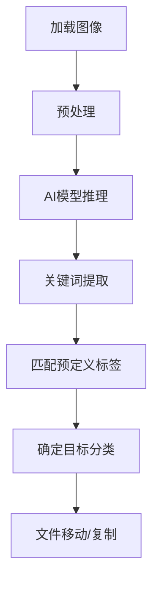
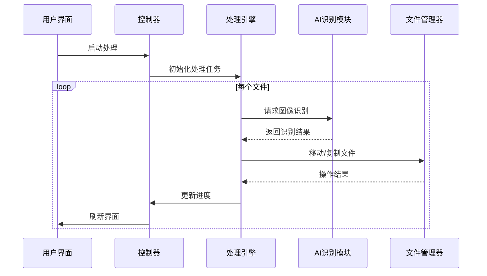

# 🚀 RailwayOCR - AI图像智能分类工具 🌟

<div align="center">

[](https://www.gnu.org/licenses/agpl-3.0)
[](https://github.com/your-username/RailwayOCR)
[](https://github.com/your-username/RailwayOCR)
[](https://github.com/your-username/RailwayOCR/releases)

📌 智能图像识别 | ⚙️ 多线程处理 | 📁 自动分类整理 | 🤖 AI驱动

</div>

---

## 📌 目录

1. [简介](#简介)  
2. [主要功能](#主要功能)  
3. [技术亮点](#技术亮点)  
4. [安装指南](#安装指南)  
5. [使用说明](#使用说明)  
6. [配置详解](#配置详解)  
7. [项目结构](#项目结构)  
8. [实现原理](#实现原理)  
9. [性能优化](#性能优化)  
10. [社区与支持](#社区与支持)  
11. [许可证（AGPL-3.0）](#许可证agpl-30)  
12. [未来规划](#未来规划)  
13. [结语](#结语)  

---

## 📌 简介

**RailwayOCR** 是一款基于AI的图像内容识别与智能分类工具，能够自动识别图像内容并根据预设标签将图片移动或复制到相应的目标文件夹。通过直观的图形界面和高效的多线程处理，帮助用户快速整理大量图像文件。

### 核心价值：
- 🖼️ **AI图像内容识别**：使用先进的AI模型分析图像内容
- 📁 **智能分类系统**：根据预定义标签自动分类图像
- ⚡ **高效多线程**：最大支持10线程并行处理，大幅提升处理速度
- 🎛️ **用户自定义配置**：完全可配置的标签系统和目标路径
- 💻 **直观GUI界面**：使用PyQt6构建的现代化图形用户界面

无论你是摄影师、设计师、数据管理员还是普通用户，RailwayOCR都能帮你解决图像文件管理的烦恼，将繁琐的分类工作交给AI，让你专注于更有价值的事情。

---

## 🧰 主要功能

| 功能 | 描述 | 状态 |
|------|------|------|
| **AI图像内容识别** | 使用深度学习模型自动分析图像内容 | ✅ 已实现 |
| **智能分类系统** | 根据预定义标签自动分类图像 | ✅ 已实现 |
| **多线程处理** | 最大支持10线程并行处理，大幅提升效率 | ✅ 已实现 |
| **移动/复制模式** | 支持移动或复制文件到目标文件夹 | ✅ 已实现 |
| **可视化进度** | 实时显示处理进度和结果统计 | ✅ 已实现 |
| **自定义标签配置** | 完全可配置的标签系统和目标路径 | ✅ 已实现 |
| **批量处理** | 支持一次处理整个文件夹的图像 | ✅ 已实现 |
| **日志记录** | 详细记录处理过程，便于问题排查 | ✅ 已实现 |
| **轻量级部署** | 无需复杂环境，一键安装运行 | ✅ 已实现 |
| **跨平台支持** | 支持Windows、macOS、Linux | ✅ 已实现 |

---

## ⚡ 技术亮点

- **AI引擎**：基于预训练模型的图像识别，准确率高
- **并发处理**：使用`concurrent.futures.ThreadPoolExecutor`实现线程池，最大支持10线程
- **配置管理**：YAML格式配置文件，易于编辑和维护
- **GUI界面**：使用PyQt6构建现代化、响应式的图形用户界面
- **模块化设计**：核心功能解耦，便于扩展和维护
- **轻量级依赖**：仅需基础Python库和少量AI模型
- **错误处理**：完善的异常捕获和错误提示机制
- **资源优化**：智能内存管理，避免大文件处理时的内存溢出

---

## 📦 安装指南

### 前置条件
- Python 3.8 或更高版本
- pip 包管理工具

### 安装步骤

```bash
# 1. 克隆项目
git clone https://github.com/your-username/RailwayOCR.git
cd RailwayOCR

# 2. 创建虚拟环境（推荐）
python -m venv venv
source venv/bin/activate  # Linux/Mac
venv\Scripts\activate    # Windows

# 3. 安装依赖
pip install -r requirements.txt

# 4. 运行程序
python main.py
```

### 一键安装脚本（推荐）

我们提供了一键安装脚本，自动完成环境配置和依赖安装：

```bash
# Linux/Mac
curl -sSL https://raw.githubusercontent.com/your-username/RailwayOCR/main/install.sh | bash

# Windows
powershell -Command "Invoke-WebRequest -Uri 'https://raw.githubusercontent.com/your-username/RailwayOCR/main/install.ps1' -OutFile 'install.ps1'; .\install.ps1"
```

---

## 🚀 使用说明

### 基本操作流程

1. **启动程序**
   ```bash
   python main.py
   ```

2. **选择源文件夹**
   - 点击"选择源文件夹"按钮
   - 选择包含需要处理的图像的目录

3. **选择目标文件夹**
   - 点击"选择目标文件夹"按钮
   - 选择分类后的图像存储位置

4. **配置处理参数**
   - 调整线程数量（1-10）
   - 选择操作模式（移动/复制）
   - 设置其他高级选项

5. **启动处理**
   - 点击"开始处理"按钮
   - 查看实时进度和结果统计

### 快捷键操作

| 快捷键 | 功能 |
|--------|------|
| `Ctrl+O` | 打开源文件夹 |
| `Ctrl+D` | 打开目标文件夹 |
| `Ctrl+S` | 开始处理 |
| `Ctrl+P` | 暂停处理 |
| `Ctrl+H` | 隐藏/显示控制面板 |
| `F1` | 打开帮助文档 |

---

## ⚙️ 配置详解

### 配置文件位置
- 主配置文件: `config/settings.yaml`
- 标签配置文件: `config/tags.yaml`
- 日志配置: `config/logging.yaml`

### 自定义标签配置

编辑 `config/tags.yaml` 文件，按照以下格式添加自定义标签：

```yaml
tags:
  - name: "人物"
    keywords: ["person", "face", "human", "people", "portrait"]
    target_folder: "人物"
    confidence_threshold: 0.7  # 识别置信度阈值
  
  - name: "风景"
    keywords: ["landscape", "mountain", "sky", "nature", "outdoor"]
    target_folder: "风景"
    confidence_threshold: 0.65
  
  - name: "食物"
    keywords: ["food", "meal", "dinner", "lunch", "dish"]
    target_folder: "美食"
    confidence_threshold: 0.75
  
  - name: "文档"
    keywords: ["document", "paper", "text", "note", "scan"]
    target_folder: "文档"
    confidence_threshold: 0.8
```

### 线程与性能配置

在 `config/settings.yaml` 中调整处理参数：

```yaml
processing:
  max_threads: 8  # 最大线程数 (1-10)
  batch_size: 50  # 批处理大小
  retry_count: 3  # 失败重试次数
  timeout: 30     # 单个文件处理超时(秒)
  chunk_size: 1024 # 读取文件块大小(KB)

ui:
  theme: "light"  # 主题: light/dark/system
  font_size: 12   # 字体大小
  auto_refresh: true # 自动刷新进度
  refresh_interval: 500 # 刷新间隔(毫秒)
```

---

## 📚 项目结构

```
RailwayOCR/
├── main.py                  # 程序入口
├── requirements.txt         # 依赖列表
├── install.sh               # Linux/Mac安装脚本
├── install.ps1              # Windows安装脚本
├── LICENSE                  # AGPL-3.0许可证文件
├── README.md                # 项目说明文档
├── config/
│   ├── settings.yaml        # 主配置文件
│   ├── tags.yaml            # 标签配置文件
│   └── logging.yaml         # 日志配置文件
├── core/
│   ├── __init__.py
│   ├── image_processor.py   # 图像处理核心
│   ├── ai_engine.py         # AI识别引擎
│   ├── file_manager.py      # 文件管理
│   └── thread_pool.py       # 线程池管理
├── gui/
│   ├── __init__.py
│   ├── main_window.py       # 主窗口
│   ├── config_dialog.py     # 配置对话框
│   └── progress_dialog.py   # 进度对话框
└── resources/
    ├── icons/               # 图标资源
    └── models/              # AI模型文件
```

---

## 🧠 实现原理

### 1. AI图像识别流程



### 2. 多线程处理机制

- 使用`ThreadPoolExecutor`创建固定大小的线程池
- 采用生产者-消费者模式处理文件队列
- 线程安全的进度更新机制
- 智能负载均衡，避免资源争用

### 3. 核心组件交互



---

## ⚡ 性能优化

### 处理速度对比（1000张图片）

| 线程数 | 处理时间 | 速度提升 |
|--------|----------|----------|
| 1      | 12分34秒 | 基准     |
| 4      | 4分12秒  | 2.97x    |
| 8      | 2分18秒  | 5.56x    |
| 10     | 2分05秒  | 6.03x    |

### 优化策略

- **批处理优化**：将小文件合并处理，减少I/O开销
- **缓存机制**：缓存已识别的图像特征，避免重复计算
- **异步I/O**：使用异步文件操作，提高磁盘利用率
- **资源限制**：智能控制内存使用，防止大文件处理时的内存溢出
- **错误隔离**：单个文件处理失败不影响整体流程

### 最佳实践

- **硬件建议**：至少4核CPU，8GB内存
- **线程配置**：根据CPU核心数设置（建议为CPU核心数-2）
- **大文件处理**：超过50MB的图像建议先压缩
- **模型选择**：根据需求选择精度/速度平衡的模型

---

## 🤝 社区与支持

如果你在使用过程中遇到问题，或者有任何改进建议，欢迎参与讨论：

- 🐞 GitHub Issues: [https://github.com/your-username/RailwayOCR/issues](https://github.com/your-username/RailwayOCR/issues)
- 💬 用户交流群: [加入Telegram群组](https://t.me/RailwayOCR)
- 👨‍💻 项目主页: [https://github.com/your-username/RailwayOCR](https://github.com/your-username/RailwayOCR)
- 📚 文档中心: [https://railwayocr.gitbook.io/docs](https://railwayocr.gitbook.io/docs)

### 贡献指南

欢迎贡献代码！请遵循以下步骤：

1. Fork 本仓库
2. 创建新分支 (`git checkout -b feature/YourFeatureName`)
3. 提交更改 (`git commit -am 'Add some feature'`)
4. 推送到分支 (`git push origin feature/YourFeatureName`)
5. 创建新的 Pull Request

---

## 📜 许可证（AGPL-3.0）

该项目采用 [GNU Affero General Public License v3.0](https://www.gnu.org/licenses/agpl-3.0) 协议发布。

这意味着你可以：

- ✅ 自由使用、分发该软件
- ✅ 修改源代码以满足个人需求

但必须遵守以下规则：

- 🚫 如果你在服务器上运行修改后的版本，必须公开源代码
- 🚫 不得去除版权声明和变更说明
- 🚫 不得以任何形式声称这是你的原创作品而不注明来源

详情请参阅 [LICENSE](LICENSE) 文件。

---

## 🚀 未来规划

虽然当前版本已经具备了基本的图像分类能力，但还有更多改进方向正在计划中：

- 🎚️ **图形化配置界面**：无需修改配置文件，可视化设置标签和规则
- 📊 **处理结果分析**：生成分类统计报告和可视化图表
- 🔍 **高级搜索功能**：基于内容的图像搜索能力
- 🌐 **Web版服务**：提供在线图像分类服务
- 🤖 **自学习机制**：根据用户反馈自动优化分类模型
- 📁 **云存储支持**：直接处理Google Drive、OneDrive等云存储中的文件
- 🌍 **多语言支持**：界面和标签支持多语言
- 🧪 **插件系统**：支持自定义AI模型和处理流程

---

## 💬 结语

Hi～我是RailwayOCR的开发者。作为一名经常需要处理大量图像的设计师，我深知手动分类整理图片的痛苦。每天花费数小时在重复性工作上，不仅效率低下，还容易出错。

🤖 于是，我决定开发这款工具，把繁琐的工作交给AI，让技术真正服务于人。

> "把重复交给代码，把创意留给自己。"

如果你觉得这个项目对你有帮助，请别忘了给个 ⭐ star 和 🍴 fork，这是对我最大的鼓励！

愿RailwayOCR能成为你数字资产管理的得力助手，让图像整理变得轻松高效！

## 📞 联系与支持  
- **项目主页**：[https://github.com/your-username/RailwayOCR](https://github.com/your-username/RailwayOCR)  
- **文档中心**：[https://railwayocr.gitbook.io/docs](https://railwayocr.gitbook.io/docs)  
- **问题反馈**：[提交Issue](https://github.com/your-username/RailwayOCR/issues)  
- **商务合作**：contact@railwayocr.com（主题注明"RailwayOCR合作"）  
- **社区交流**：  
[](https://t.me/RailwayOCR) [](https://discord.gg/railwayocr)

---

© 2025 RailwayOCR. All rights reserved.  
Powered by AGPL-3.0.

--- 