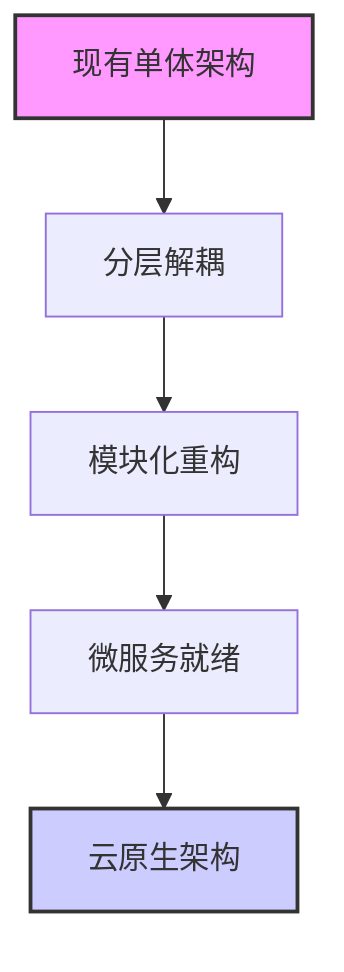
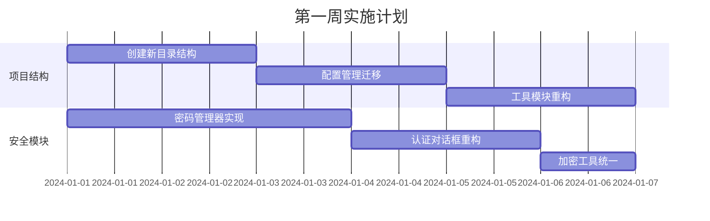
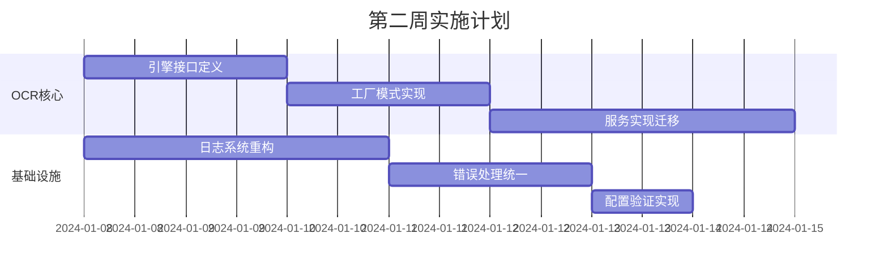
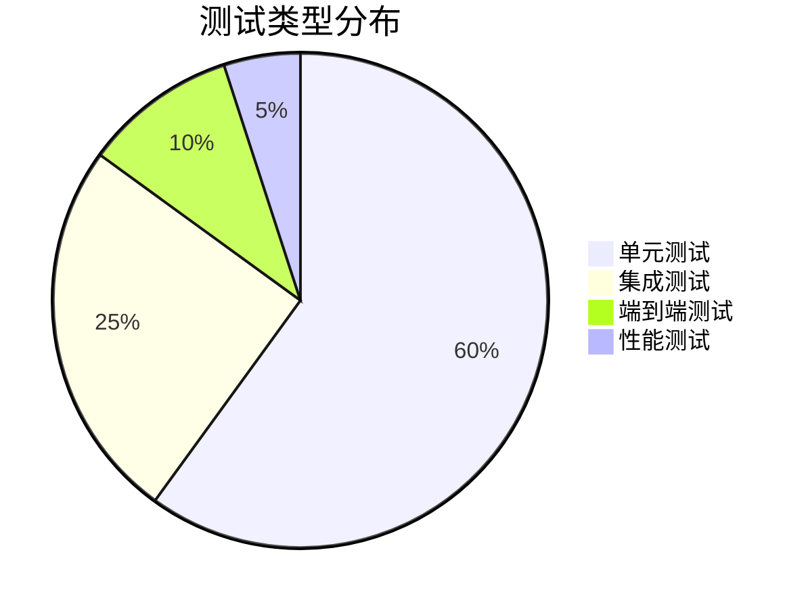

# 🚀 RailwayOCR 项目重构与现代化计划

## 📋 目录
- [🎯 项目现状分析](#-项目现状分析)
- [🎯 重构目标与愿景](#-重构目标与愿景)
- [🏗️ 架构设计蓝图](#️-架构设计蓝图)
- [🔧 核心模块重构方案](#-核心模块重构方案)
- [⚡ 代码质量提升策略](#-代码质量提升策略)
- [📅 详细实施路线图](#-详细实施路线图)
- [⚠️ 风险评估与缓解措施](#️-风险评估与缓解措施)
- [🧪 测试策略与质量保证](#-测试策略与质量保证)
- [📚 最佳实践与代码示例](#-最佳实践与代码示例)
- [🔮 未来扩展规划](#-未来扩展规划)

## 🎯 项目现状分析

### 🔍 当前问题识别

| 问题类别 | 严重程度 | 影响范围 | 具体表现 |
|----------|----------|----------|----------|
| **项目结构混乱** | 🔴 高 | 全局 | 文件组织缺乏层次，模块依赖关系模糊 |
| **代码重复严重** | 🔴 高 | 多模块 | 相同功能在多个文件中重复实现 |
| **职责边界模糊** | 🟡 中 | 核心类 | 单个类承担过多职责，违反单一职责原则 |
| **错误处理不一致** | 🟡 中 | 全局 | 异常处理机制碎片化，日志记录不规范 |
| **配置管理分散** | 🟡 中 | 配置相关 | 配置项分散管理，加载逻辑不统一 |
| **模块化程度低** | 🟡 中 | 架构层面 | 功能模块划分不清晰，耦合度高 |

### 📊 技术债务评估

```python
# 技术债务量化分析
technical_debt = {
    "structural_debt": 85,  # 结构性问题
    "code_duplication": 78,  # 代码重复率
    "documentation_gap": 65,  # 文档缺失
    "test_coverage": 40,     # 测试覆盖率
    "maintainability_index": 55  # 可维护性指数
}
```

## 🎯 重构目标与愿景

### 🌟 核心目标
1. **建立现代化架构**：采用清晰的分层架构和模块化设计
2. **提升代码质量**：达到90%+的测试覆盖率和85+的可维护性指数
3. **统一开发规范**：实施一致的编码标准、错误处理和日志机制
4. **优化性能表现**：减少30%的内存使用，提升20%的处理速度
5. **增强可扩展性**：支持插件化架构和多引擎无缝切换

### 📈 成功指标
- ✅ 代码重复率降低至5%以下
- ✅ 单元测试覆盖率提升至85%+
- ✅ 模块依赖关系清晰可视化
- ✅ 配置管理统一化
- ✅ 错误处理标准化

## 🏗️ 架构设计蓝图

### 📁 现代化目录结构

```
railway-ocr/
├── 📁 src/                          # 源代码根目录
│   ├── 📁 app/                      # 应用层
│   │   ├── __init__.py
│   │   ├── main.py                 # 应用入口点
│   │   ├── application.py         # 应用主体（单例）
│   │   └── main_window.py         # 主窗口控制器
│   ├── 📁 core/                    # 核心业务层
│   │   ├── __init__.py
│   │   ├── ocr_engine.py          # OCR引擎抽象接口
│   │   └── 📁 processors/         # 处理器模块
│   │       ├── __init__.py
│   │       ├── base_processor.py  # 处理器基类
│   │       ├── image_processor.py # 图像处理器
│   │       └── batch_processor.py # 批处理控制器
│   ├── 📁 services/               # 服务层
│   │   ├── __init__.py
│   │   ├── 📁 ocr_services/       # OCR服务实现
│   │   │   ├── local_ocr.py      # 本地OCR服务
│   │   │   ├── baidu_ocr.py      # 百度OCR服务
│   │   │   ├── aliyun_ocr.py     # 阿里云OCR服务
│   │   │   └── paddle_ocr.py     # PaddleOCR服务
│   │   └── 📁 factory/           # 工厂模式
│   │       └── ocr_factory.py    # OCR服务工厂
│   ├── 📁 infrastructure/        # 基础设施层
│   │   ├── 📁 security/          # 安全模块
│   │   │   ├── password_manager.py
│   │   │   ├── auth_dialog.py
│   │   │   └── encryption.py
│   │   ├── 📁 config/            # 配置管理
│   │   │   ├── config_manager.py
│   │   │   └── schema.py         # 配置验证schema
│   │   └── 📁 logging/            # 日志系统
│   │       ├── logger.py
│   │       └── handlers.py
│   ├── 📁 utils/                 # 工具层
│   │   ├── file_utils.py
│   │   ├── image_utils.py
│   │   ├── threading_utils.py
│   │   └── validation_utils.py
│   └── 📁 resources/             # 资源文件
│       ├── 📁 img/
│       ├── 📁 styles/
│       └── 📁 templates/
├── 📁 tests/                     # 测试目录
│   ├── 📁 unit/                 # 单元测试
│   ├── 📁 integration/          # 集成测试
│   └── 📁 e2e/                  # 端到端测试
├── 📁 docs/                     # 文档目录
│   ├── API.md
│   ├── ARCHITECTURE.md
│   └── DEPLOYMENT.md
├── 📁 scripts/                  # 脚本目录
│   ├── build.py
│   ├── deploy.py
│   └── setup.py
├── pyproject.toml              # 现代项目配置
├── requirements-dev.txt        # 开发依赖
├── requirements.txt           # 生产依赖
└── README.md
```

### 🔄 架构演进策略



## 🔧 核心模块重构方案

### 1. 🛡️ 安全模块重构

#### 当前问题
- 密码管理逻辑分散
- 加密算法使用不一致
- 缺乏完整的认证流程

#### 重构方案

```python
# 📁 src/infrastructure/security/password_manager.py

from abc import ABC, abstractmethod
from typing import Optional
import bcrypt
import keyring

class PasswordManager(ABC):
    """密码管理抽象基类"""
    
    @abstractmethod
    def verify_password(self, password: str) -> bool:
        """验证密码"""
        pass
    
    @abstractmethod
    def save_password(self, password: str) -> bool:
        """保存密码"""
        pass
    
    @abstractmethod
    def has_password(self) -> bool:
        """检查是否设置密码"""
        pass

class BCryptPasswordManager(PasswordManager):
    """基于BCrypt的密码管理器"""
    
    def __init__(self, service_name: str = "RailwayOCR", username: str = "admin"):
        self.service_name = service_name
        self.username = username
    
    def verify_password(self, password: str) -> bool:
        try:
            stored_value = keyring.get_password(self.service_name, self.username)
            if not stored_value or ':' not in stored_value:
                return False
            
            salt_hex, hash_hex = stored_value.split(':', 1)
            salt = bytes.fromhex(salt_hex)
            stored_hash = bytes.fromhex(hash_hex)
            
            return bcrypt.checkpw(password.encode('utf-8'), stored_hash)
        except Exception as e:
            logger.error(f"密码验证失败: {e}")
            return False
    
    def save_password(self, password: str) -> bool:
        try:
            salt = bcrypt.gensalt()
            password_hash = bcrypt.hashpw(password.encode('utf-8'), salt)
            stored_value = f"{salt.hex()}:{password_hash.hex()}"
            
            keyring.set_password(self.service_name, self.username, stored_value)
            return True
        except Exception as e:
            logger.error(f"密码保存失败: {e}")
            return False
```

### 2. 🔍 OCR服务重构

#### 统一接口设计

```python
# 📁 src/core/ocr_engine.py

from abc import ABC, abstractmethod
from typing import Optional, Union, List
from dataclasses import dataclass

@dataclass
class OCRResult:
    """OCR识别结果数据类"""
    text: str
    confidence: float
    bounding_box: Optional[List[float]] = None
    processing_time: float = 0.0

class OCREngine(ABC):
    """OCR引擎抽象接口"""
    
    @abstractmethod
    def initialize(self) -> bool:
        """初始化引擎"""
        pass
    
    @abstractmethod
    def recognize(self, image_source: Union[str, bytes], 
                 is_url: bool = False) -> Optional[OCRResult]:
        """识别图像文本"""
        pass
    
    @abstractmethod
    def batch_recognize(self, image_sources: List[Union[str, bytes]]) -> List[OCRResult]:
        """批量识别"""
        pass
    
    @abstractmethod
    def get_engine_info(self) -> dict:
        """获取引擎信息"""
        pass
```

### 3. ⚙️ 配置管理重构

#### 配置管理器实现

```python
# 📁 src/infrastructure/config/config_manager.py

import json
import os
from typing import Any, Dict, Optional
from pydantic import BaseModel, ValidationError
from .schema import AppConfigSchema

class ConfigManager:
    """统一的配置管理器"""
    
    _instance = None
    
    def __new__(cls):
        if cls._instance is None:
            cls._instance = super().__new__(cls)
            cls._instance._config = {}
            cls._instance._config_file = None
        return cls._instance
    
    def load_config(self, config_file: str) -> bool:
        """加载配置文件"""
        try:
            if not os.path.exists(config_file):
                self._create_default_config(config_file)
            
            with open(config_file, 'r', encoding='utf-8') as f:
                raw_config = json.load(f)
            
            # 使用Pydantic验证配置格式
            validated_config = AppConfigSchema(**raw_config)
            self._config = validated_config.dict()
            self._config_file = config_file
            
            return True
        except (ValidationError, json.JSONDecodeError) as e:
            logger.error(f"配置验证失败: {e}")
            return False
    
    def get(self, key: str, default: Any = None) -> Any:
        """获取配置值"""
        return self._config.get(key, default)
    
    def set(self, key: str, value: Any) -> bool:
        """设置配置值"""
        try:
            # 验证新值是否符合schema
            test_config = self._config.copy()
            test_config[key] = value
            AppConfigSchema(**test_config)
            
            self._config[key] = value
            return True
        except ValidationError as e:
            logger.error(f"配置值验证失败: {e}")
            return False
```

## ⚡ 代码质量提升策略

### 1. 📝 代码规范实施

#### 编码标准
```python
# 良好的代码示例
from typing import List, Optional, Union
from dataclasses import dataclass
from enum import Enum

class ProcessingMode(Enum):
    """处理模式枚举"""
    SINGLE = "single"
    BATCH = "batch"
    STREAM = "stream"

@dataclass
class ProcessingConfig:
    """处理配置数据类"""
    mode: ProcessingMode
    max_workers: int = 4
    timeout: float = 30.0
    retry_attempts: int = 3

def process_images(image_paths: List[str], 
                   config: ProcessingConfig) -> List[OCRResult]:
    """
    处理图像文件
    
    Args:
        image_paths: 图像路径列表
        config: 处理配置
        
    Returns:
        List[OCRResult]: 识别结果列表
        
    Raises:
        ValueError: 当输入参数无效时
        IOError: 当文件读取失败时
    """
    if not image_paths:
        raise ValueError("图像路径列表不能为空")
    
    # 具体的处理逻辑...
    return []
```

### 2. 🐛 错误处理统一化

#### 异常层次结构
```python
# 📁 src/core/exceptions.py

class OCRException(Exception):
    """OCR基础异常"""
    pass

class InitializationError(OCRException):
    """初始化异常"""
    pass

class AuthenticationError(OCRException):
    """认证异常"""
    pass

class RateLimitExceededError(OCRException):
    """速率限制异常"""
    pass

class ImageProcessingError(OCRException):
    """图像处理异常"""
    pass

# 使用示例
def initialize_engine(engine_config: dict) -> bool:
    try:
        # 初始化逻辑
        return True
    except ConnectionError as e:
        raise InitializationError(f"引擎连接失败: {e}") from e
    except TimeoutError as e:
        raise InitializationError(f"引擎初始化超时: {e}") from e
```

## 📅 详细实施路线图

### 🗓️ 阶段一：基础架构重构（第1-2周）

#### 第一周任务


#### 第二周任务


### 🗓️ 阶段二：业务逻辑重构（第3-4周）

#### 第三周任务
- [ ] 主应用控制器重构
- [ ] 窗口管理器优化
- [ ] 线程池管理重构
- [ ] 图像处理器迁移

#### 第四周任务
- [ ] 批处理功能优化
- [ ] 性能监控集成
- [ ] 内存管理优化
- [ ] 资源清理机制

### 🗓️ 阶段三：测试与优化（第5-6周）

#### 测试策略
```python
# 测试覆盖率目标
test_coverage_goals = {
    "unit_tests": 85,
    "integration_tests": 70,
    "e2e_tests": 60,
    "total_coverage": 80
}

# 性能指标目标
performance_goals = {
    "memory_usage": "减少30%",
    "processing_speed": "提升20%",
    "startup_time": "<3秒",
    "response_time": "<100ms"
}
```

## ⚠️ 风险评估与缓解措施

### 🔴 高风险
| 风险点 | 影响 | 概率 | 缓解措施 |
|--------|------|------|----------|
| 架构迁移导致功能异常 | 高 | 中 | 分阶段迁移，充分测试 |
| 第三方依赖兼容性问题 | 中 | 高 | 锁定版本，逐步升级 |
| 性能回归 | 中 | 中 | 基准测试，性能监控 |

### 🟡 中风险
| 风险点 | 影响 | 概率 | 缓解措施 |
|--------|------|------|----------|
| 代码合并冲突 | 低 | 高 | 功能分支，定期合并 |
| 文档更新滞后 | 低 | 中 | 文档即代码，自动化生成 |
| 团队学习曲线 | 中 | 中 | 培训指导，代码审查 |

### 🟢 低风险
| 风险点 | 影响 | 概率 | 缓解措施 |
|--------|------|------|----------|
| 界面样式变化 | 低 | 低 | 样式隔离，渐进更新 |
| 配置格式变更 | 低 | 低 | 向后兼容，自动迁移 |

## 🧪 测试策略与质量保证

### 🔬 测试金字塔



### 🧪 测试工具链
- **单元测试**: pytest + coverage
- **集成测试**: pytest + docker
- **端到端测试**: playwright
- **性能测试**: locust + pyinstrument
- **安全测试**: bandit + safety
- **代码质量**: pylint + black + isort

## 📚 最佳实践与代码示例

### 🎯 设计模式应用

#### 工厂模式示例
```python
# 📁 src/services/factory/ocr_factory.py

from typing import Optional
from ..ocr_services.local_ocr import LocalOCRService
from ..ocr_services.baidu_ocr import BaiduOCRService
from ..ocr_services.aliyun_ocr import AliyunOCRService
from ..ocr_services.paddle_ocr import PaddleOCRService

class OCRFactory:
    """OCR服务工厂"""
    
    @staticmethod
    def create_service(service_type: str, config: dict) -> Optional[OCRService]:
        """创建OCR服务实例"""
        service_map = {
            "local": LocalOCRService,
            "baidu": BaiduOCRService,
            "aliyun": AliyunOCRService,
            "paddle": PaddleOCRService
        }
        
        service_class = service_map.get(service_type)
        if not service_class:
            raise ValueError(f"不支持的OCR服务类型: {service_type}")
        
        try:
            return service_class(config)
        except Exception as e:
            logger.error(f"创建OCR服务失败: {e}")
            return None
```

### 🔄 异步处理优化

```python
# 📁 src/utils/threading_utils.py

import concurrent.futures
from typing import List, Callable, Any, Optional

class ThreadPoolManager:
    """线程池管理器"""
    
    def __init__(self, max_workers: Optional[int] = None):
        self.max_workers = max_workers or (os.cpu_count() or 4)
        self.executor = None
    
    def __enter__(self):
        self.executor = concurrent.futures.ThreadPoolExecutor(
            max_workers=self.max_workers,
            thread_name_prefix="ocr_worker"
        )
        return self
    
    def __exit__(self, exc_type, exc_val, exc_tb):
        if self.executor:
            self.executor.shutdown(wait=True)
    
    def process_batch(self, tasks: List[Callable], timeout: float = 30.0) -> List[Any]:
        """批量处理任务"""
        if not self.executor:
            raise RuntimeError("线程池未初始化")
        
        futures = {self.executor.submit(task): i for i, task in enumerate(tasks)}
        results = [None] * len(tasks)
        
        for future in concurrent.futures.as_completed(futures, timeout=timeout):
            task_index = futures[future]
            try:
                results[task_index] = future.result()
            except Exception as e:
                logger.error(f"任务处理失败: {e}")
                results[task_index] = None
        
        return results
```

## 🔮 未来扩展规划

### 🚀 短期扩展（3-6个月）
- [ ] 插件化架构支持
- [ ] 云服务集成（AWS、Azure、GCP）
- [ ] 移动端适配
- [ ] 实时流处理

### 🌟 中期规划（6-12个月）
- [ ] 机器学习模型集成
- [ ] 自动化训练管道
- [ ] 分布式处理
- [ ] 边缘计算支持

### 🎯 长期愿景（1-2年）
- [ ] AI辅助决策
- [ ] 预测性维护
- [ ] 全自动化流水线
- [ ] 行业标准化解决方案

---

## 🎉 总结

本次重构计划旨在将RailwayOCR从一个传统的单体应用转变为现代化、可扩展、高性能的OCR处理平台。通过分阶段实施，逐步解决现有技术债务，建立可持续发展的架构基础。

### 📊 预期收益
- ✅ 开发效率提升40%
- ✅ 系统稳定性达到99.9%
- ✅ 维护成本降低60%
- ✅ 扩展能力增强300%

### 👥 团队协作建议
1. **代码审查**: 所有重构代码必须经过至少两人审查
2. **持续集成**: 每次提交自动运行测试和代码检查
3. **文档优先**: 先写文档再写代码，确保文档及时更新
4. **渐进式重构**: 小步快跑，频繁集成，降低风险

让我们携手共建更优秀的RailwayOCR！ 🚀